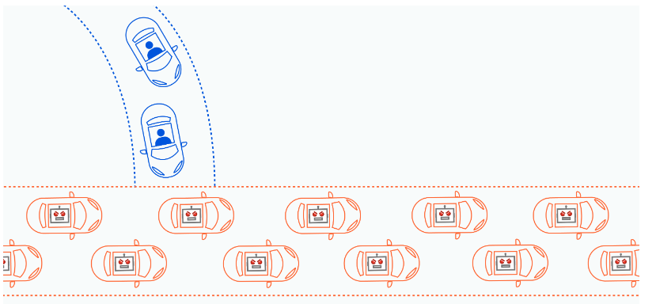
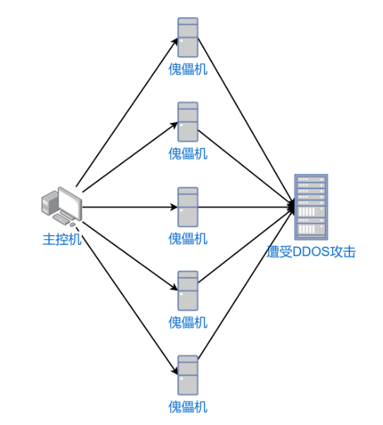
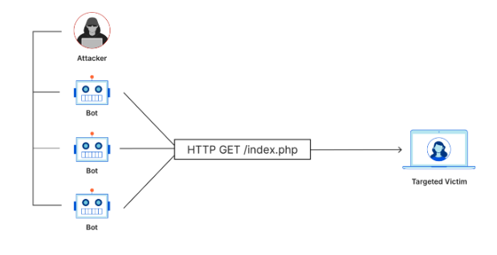
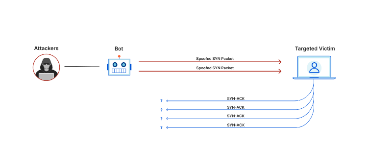
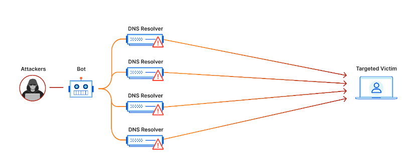
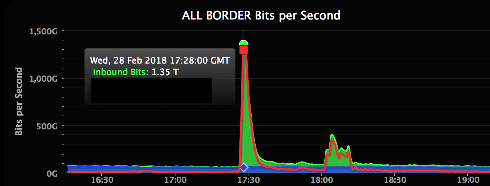
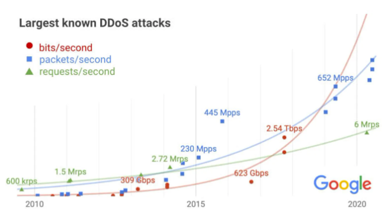
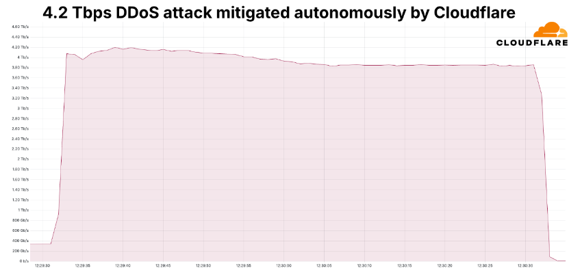
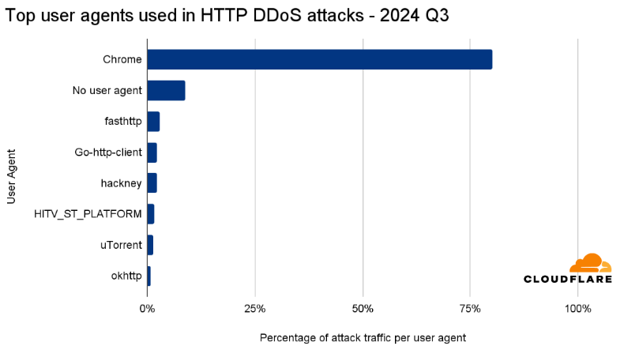
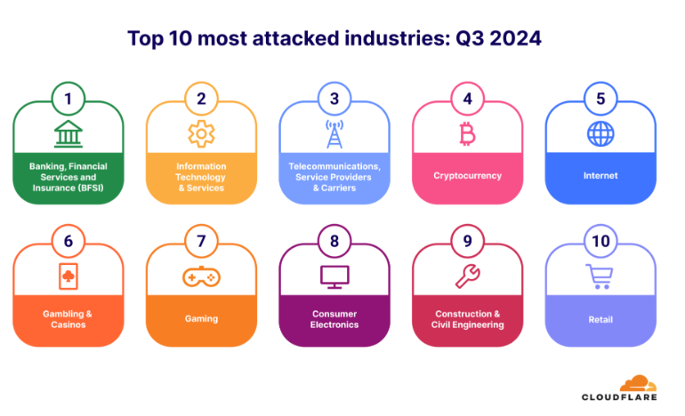

# DDoS 攻击简介
> 网络攻击已经成为我们日常生活和工作中不可忽视的威胁，尤其是像 DDoS 攻击这样的常见手段，它们不仅对个人，还对企业和社会都带来很大影响。希望通过这篇简单的文章，带大家了解这些攻击方式是如何运作的，也能在日常中更好地应对潜在风险，网络攻击类型繁多，其中一些可能对我们的个人隐私、金融安全和商业运营造成严重影响。这里将介绍一些常见的网络攻击类型；

- DDos 攻击:
  - 分布式拒绝服务（DDoS）攻击是通过大规模互联网流量淹没目标服务器或其周边基础设施，以破坏目标服务器、服务或网络正常流量的恶意行为。
  - DDoS 攻击利用多台受损计算机系统作为攻击流量来源以达到攻击效果。
  - 总体而言，DDoS 攻击好比高速公路发生交通堵塞，妨碍常规车辆抵达预定目的地。
  

    

- 如何识别 DDoS:
  - 来自单个 IP 地址或 IP 范围的可疑流量
  - 来自共享单个行为特征（例如设备类型、地理位置或 Web 浏览器版本）的用户的大量流量
  - 对单个页面或端点的请求数量出现不明原因的激增
  - 奇怪的流量模式，例如一天中非常规时间段的激增或看似不自然的模式（例如，每 10 分钟出现一次激增）
  
- DDoS 攻击类型：
  - 应用层攻击（Application Layer Attacks）：
    - 目标：
      - 通过模拟正常用户的请求，向目标服务器发送大量的请求，从而消耗服务器的资源，使其无法正常处理合法请求。
    - 特征：
      - 模拟合法请求，难以区分恶意与正常流量。
    - 常见类型：
      - HTTP Flood：发送大量HTTP GET/POST请求，压垮Web服务器。
      - Slowloris：通过缓慢发送HTTP请求，长期占用服务器连接。
      - DNS Query Flood：向DNS服务器发送大量查询请求。
  
    
  
  - 协议型攻击（Protocol Attacks）：
    - 目标：
      - 通过向目标系统发送大量的TCP SYN 请求，但没有完成连接，使连接处于半开状态，使系统资源不堪重负。协议攻击可能导致带宽或主机或网络设备的连接达到上限。
    - 特征：
      - 攻击集中在网络层或传输层，针对协议处理机制。
    - 常见类型：
      - SYN Flood：发送大量TCP SYN请求但不完成握手，耗尽服务器连接表。
      - Ping of Death：发送畸形或超大ICMP数据包，导致系统崩溃。
      - Smurf Attack：伪造源IP广播ICMP请求，引发大量响应。

    
  
  - 容量型攻击（Volumetric Attacks）：
    - 目标：
      - 通过消耗目标系统的资源，使其无法正常提供服务。这种攻击利用了目标系统的资源限制或者容量限制，通过持续地发送请求或者占用资源，耗尽目标系统的可用资源，从而导致其无法响应合法用户的请求。
    - 特征：
      - 发送海量数据包，堵塞网络管道
    - 常见类型：
      - UDP Flood：发送大量UDP数据包，通常利用随机端口或伪造源IP。
      - ICMP Flood（Ping Flood）：发送大量ICMP请求（如ping），耗尽带宽。
      - DNS Amplification：利用开放的DNS服务器，通过小请求触发大响应，放大流量。
  
    

- 如何防护/缓解 DDoS 攻击:
  - 黑洞路由
    - 在防火墙或路由器上设置黑名单屏蔽已知恶意IP，白名单允许可信来源。
  - 速率限制
    - 在应用层限制每个IP的连接频率（如Nginx的limit_conn模块）。
  - WAF（Web应用防火墙）
    - 部署WAF（如Cloudflare WAF、AWS WAF）过滤恶意请求，识别基于HTTP/HTTPS的攻击（如SQL注入、XSS）。
  - CDN 服务
    - 使用内容分发网络（如Cloudflare、Akamai、Fastly）缓存静态内容并过滤恶意流量。
    - CDN可 以吸收大量流量，减轻服务器压力。
  - 分布式部署
    - 将服务分布在多个数据中心或云服务提供商（如AWS、Azure、Cloudflare），利用地理分布降低单点故障风险。
  - 实施负载均衡
    - 使用负载均衡器（如F5、Nginx、AWS ELB）分散流量，避免单一服务器过载。
  - DNS 防护
    - 使用抗DDoS DNS服务：如Cloudflare DNS、Route 53，防止DNS放大攻击。
    - 隐藏源IP：通过代理或CDN隐藏真实服务器IP，降低直接攻击风险。
  
- 案例与数据分析
  - 2018 年 2 月 gitHub 遭受的攻击是一次 memcached DDoS 攻击，攻击者利用了 memcached 这种流行数据库缓存系统的放大效应。通过向 memcached 服务器发送大量虚假请求，攻击者成功将其攻击放大约 5 万倍。
  - [memcached DDoS 攻击](https://github.blog/news-insights/company-news/ddos-incident-report/)
  
    

  - 2017 年 9 月针对 Google 服务攻击，攻击者向 18 万个 web 服务器发送虚假请求，其流量达 2.54 Tbps，是迄今为止有记录以来最大的 DDoS 攻击之一。
  

- **Cloudflare 2024年Q3 DDoS 报告**
  - 600 万次 DDoS （Q1：450万次，Q2：400 万次）
  - 2024 年 10 月 21 日，检测到持续约一分钟的最高峰值 4.2 Tbps DDoS 攻击，成为历史最大的 DDos
  

- **DDoS 攻击类型和特征**
  - HTTP（应用层）DDoS攻击
  - 网络层 DDoS攻击
  
- **攻击持续时间**
  - 90% 的 DDoS 攻击（包括最大的攻击）都是非常短暂的。
  - 持续超过一个小时的攻击占所有攻击的 3%。
  
- **HTTP攻击属性**
  - 89% 的 HTTP DDoS 攻击流量使用 GET 方法
  - 80% 的 DDoS 攻击请求通过 HTTP/2，19% 通过 HTTP/1.1
  - 80% 的 HTTP DDoS 攻击流量冒充*Google Chrome*浏览器
  

- **最受攻击的行业**
  - 银行和金融服务
  - 信息技术和服务
  - 电信、服务提供商和运营商行业
  - 加密货币
  - 互联网
  - 赌博和赌场
  - 游戏
  - 消费电子产品
  - 建筑与土木工程
  - 零售行业
  
    

- **总结**

DDoS攻击作为网络安全领域的重大威胁，对服务可用性构成严重挑战。通过构建多层次的防护体系，包括网络架构优化、实时监控、专业防护服务以及应急响应机制，可以有效降低攻击风险并快速恢复服务。面对日益复杂的攻击手法，持续更新防护策略、加强团队培训和行业协作至关重要。只有通过预防、检测和响应的综合措施，才能在动态的网络环境中确保业务的连续性和安全性，为用户提供稳定可靠的服务。