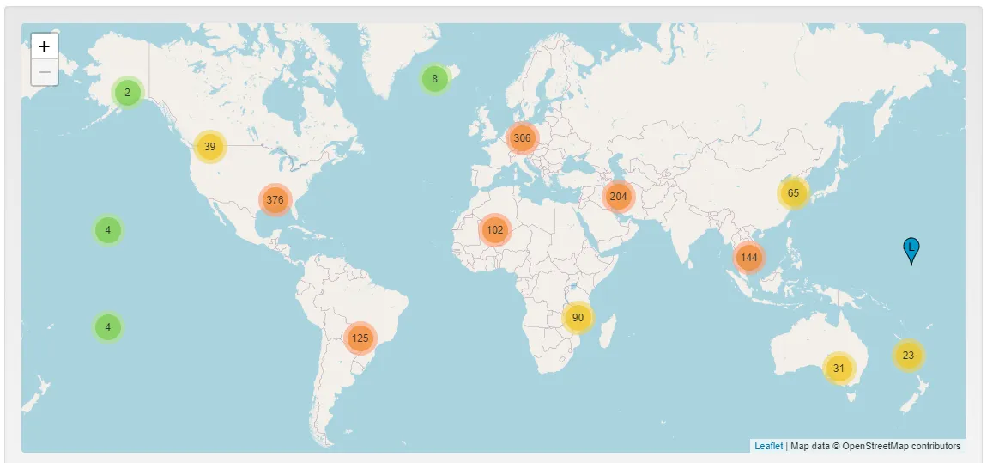
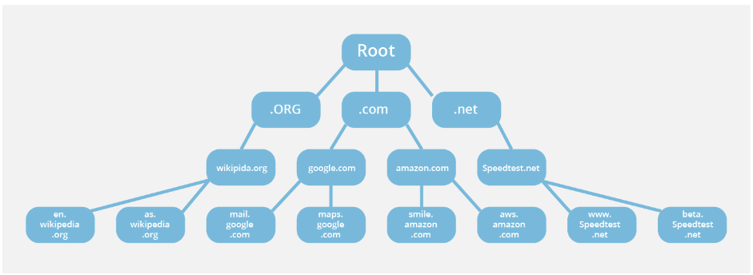
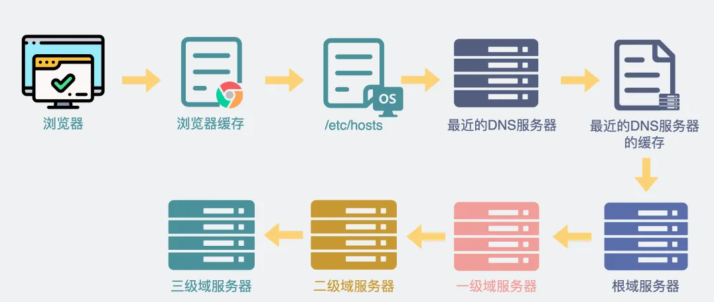
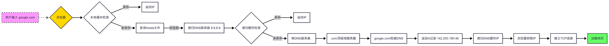
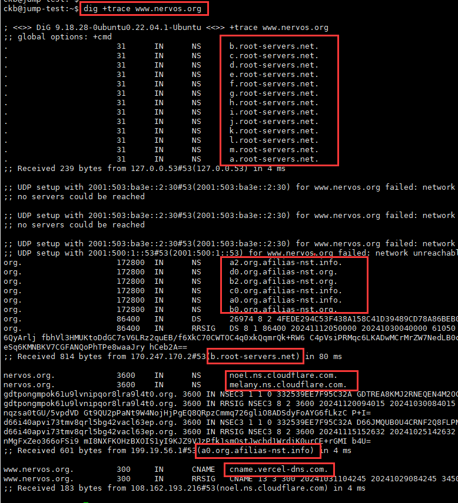
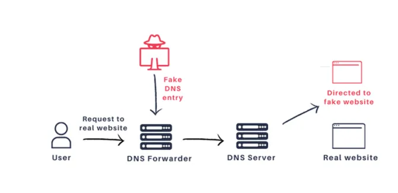
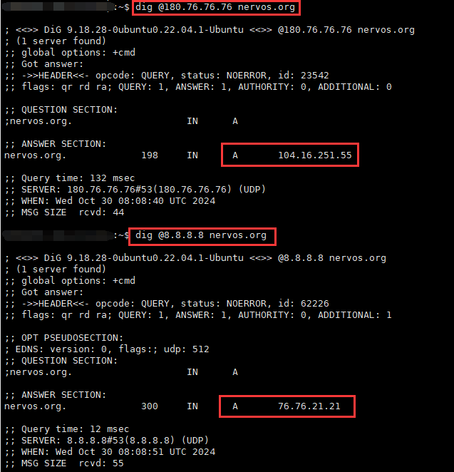
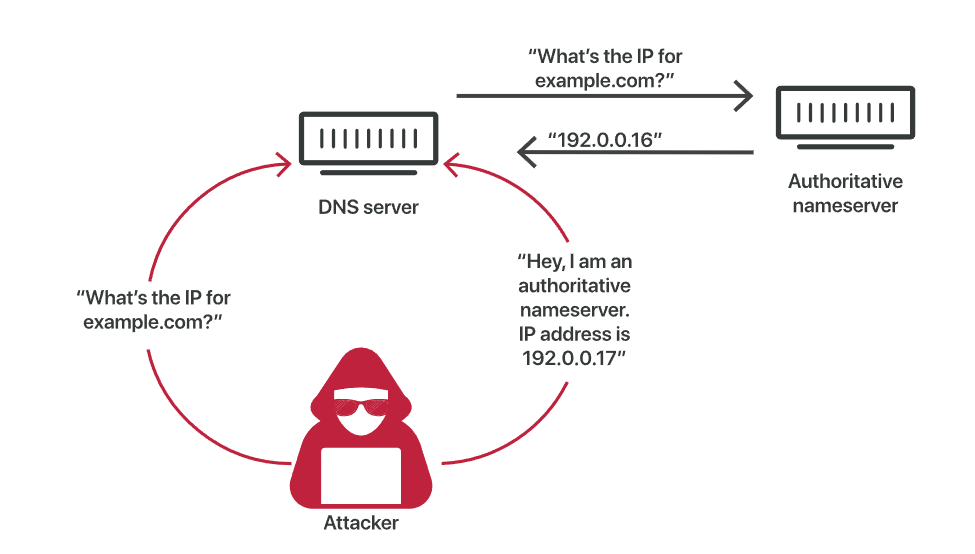
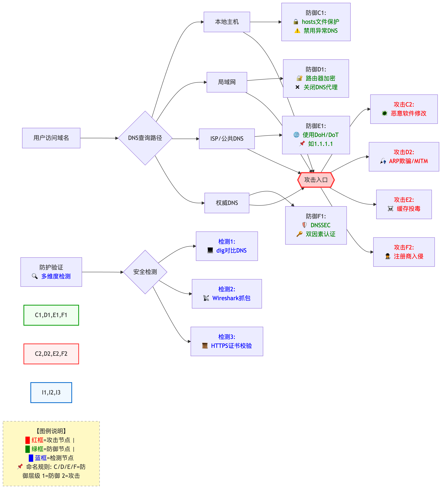

# DNS劫持攻击
> DNS 域名劫持属于一种中间人攻击（Man-in-the-Middle, MITM）。其主要目的是在用户与目标服务器之间插入恶意节点，将域名由正常IP指向攻击者控制的IP，以达到流量劫持、流量监控或数据盗窃的目的。这种攻击会通过伪造 DNS 记录，将用户引导到攻击者的恶意网站，进而窃取敏感信息，或用来分发恶意软件。

- **DNS 根服务器**：
  - 负责管理和解析域名到 IP 地址的查询。它们是所有 DNS 查询的起点，处理来自各地的请求，将查询指向合适的顶级域名（TLD）服务器。
  - 12 个运营商
  - 13 “台”根域服务器（每一台“根服务器”实际上由多个物理服务器组成）
  - 名称为（A、B、C、D、E、F、G、H、I、J、K、L、M ）
  - 分布，可以通过这个网站查询 https://root-servers.org/

    

- **DNS 的分层结构**：
  - 根域名服务器
  - 顶级域名服务器
  - 权威域名服务器
  - 本地域名服务器
  
    

- **DNS 域名解析的全过程**:
  - 用户浏览请求网站解析过程
  
    

    

  - 用dig+trace 命令查看域名解析过程
  
    

- **DNS 劫持的攻击方式**:
  - 本地 DNS劫持：篡改用户设备的DNS设置，强制用户通过恶意的DNS服务器进行查询。
      - 入侵路由器
      - 恶意软件
  
      

  - ISP DNS劫持：ISP（网络运营商）有意地修改或重定向 DNS 查询结果。
    - 广告推送
    - 内容审查
    - 测试同一个网站用百度DNS 和 google DNS 返回的IP不一致

    

  - 注册商 DNS劫持：攻击者通过获得域名注册信息的控制权，修改域名的 DNS 设置，使得该域名指向他们控制的服务器。
      - 社会工程学攻击
      - 域名注册商的账户凭证泄漏
      - DNS解析服务商的账户凭证泄漏
  - DNS 缓存投毒：攻击者通过向 DNS 服务器发送伪造的响应，来篡改 DNS 缓存中的记录。当用户查询某个域名时，服务器会返回恶意网站的 IP 地址，而不是正常的网站。
      - DNS 协议的漏洞
        
    

  - 中间人攻击：攻击者通过拦截用户与 DNS 服务器之间的通信，劫持 DNS 查询并返回伪造的响应。
      - 开放的 WiFi 网络

- **预防 DNS劫持攻击措施**:
    - 选择可信的公共 DNS 服务器
        - Google DNS (8.8.8.8) 或 Cloudflare DNS (1.1.1.1)
        - Aliyun DNS (223.5.5.5) 或 DNSPod (119.29.29.29)
    - 定期检查 DNS 配置
    - 加密 DNS
        - 如 Chrome：设置→隐私和安全→安全→使用安全DNS→选择DNS 提供商
    - 加密数据传输 HTTPS
    - 启用 DNSSEC（DNS Security Extensions）
        - DNSSEC 是一种用于保护 DNS 数据的安全扩展，通过数字签名确保 DNS 响应的真实性，防止缓存投毒等攻击。实施 DNSSEC 可以帮助用户确认接收到的 DNS 响应是合法的。
        - 主流的域名注册商如 GoDaddy、Namecheap 和 Google Domains 都提供此功能
    - 选择可靠的 DNS 运营商
        - Cloudflare
        - Amazon Route 53
        - Namecheap
        - Google Cloud DNS
    - 强化域名安全
        - 对域名注册商账户启用两步验证（2FA），确保账户安全，防止未经授权的访问
        - 定期更新您的账户密码，使用强密码
  
    

        
        

        图：DNS 劫持安全防护措施流程图
        

    

- **总结**

DNS 劫持攻击通过篡改域名解析过程，将用户请求重定向到恶意服务器，严重威胁网络安全和用户隐私。以 google.com 的解析流程为例，正常情况下，客户端通过本地解析器、根服务器、TLD 服务器和权威服务器逐步获取正确的 IP 地址（如 142.250.190.14）。然而，DNS 劫持可能在任一环节（如本地解析器或网络层）插入虚假响应，导致用户被引导至恶意网站，面临数据泄露、钓鱼攻击或恶意软件感染的风险。

这种攻击的危害不容忽视：它不仅破坏用户信任，还可能导致财务损失或敏感信息泄露。攻击者可能通过伪造 DNS 响应、入侵 DNS 服务器或利用缓存投毒等手段实施劫持。为有效防御，建议用户启用 DNSSEC 以验证 DNS 响应的真实性，使用可信的公共 DNS 服务（如 8.8.8.8 或 1.1.1.1），并定期更新系统和路由器固件以修补漏洞。企业则应部署入侵检测系统，监控异常 DNS 流量。

总之，DNS 劫持攻击暴露了互联网基础设施的脆弱性。加强用户教育、提升技术防护措施并推广安全协议是应对这一威胁的关键。通过构建更安全的 DNS 生态系统，我们可以有效降低劫持风险，保护网络通信的完整性和可靠性