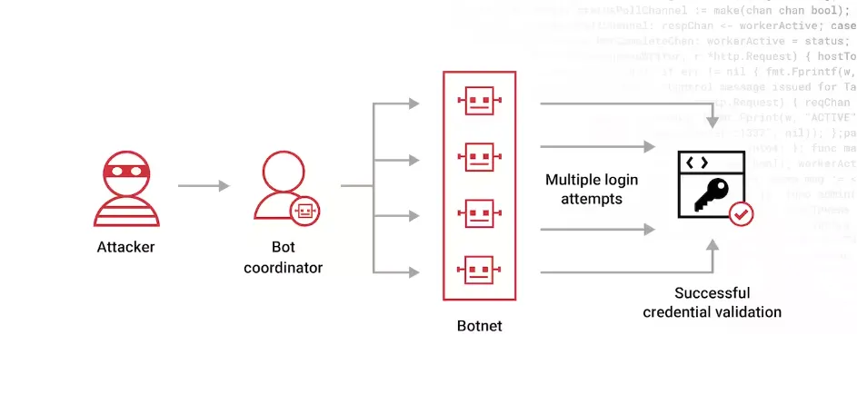

# 密码攻击类型与安全措施简介
> 密码攻击是一种试图获取密码等敏感信息的攻击行为。攻击者通常使用各种方法来尝试猜测或者获取密码，从而获取对受攻击者账户或系统的访问权限。

密码攻击类型：
- 暴力破解：攻击者使用自动化程序或者脚本尝试大量的可能密码组合，直到找到正确的密码为止。这种攻击方式通常需要耗费大量时间和计算资源，但对于弱密码而言仍然是一种有效的攻击方式。                                                                              

- 密码喷洒：是一种常见的密码攻击技术，用于尝试猜测大量用户的密码，以获取对目标系统或服务的访问权限。与传统的暴力破解攻击不同，密码喷洒攻击通常不会尝试使用大量密码来猜测单个用户的账户，而是尝试使用一组常见的密码（如“password”、“123456”等）来尝试登录多个用户的账户。

- 字典攻击：攻击者使用预先准备好的密码字典，其中包含常用密码、常见单词、名字、日期等可能的密码组合，然后尝试使用这些密码来登录目标账户或系统。

- 社会工程学：攻击者通过欺骗、诱导、伪装等手段来获取用户的密码，通常通过诱使用户提供密码或者直接窃取密码信息。

  
- 钓鱼攻击：攻击者通过伪装成合法的机构或者网站，诱使用户输入密码或其他敏感信息，然后窃取这些信息用于攻击目的。

安全措施：
- 使用强密码：使用复杂、长且包含多种字符类型的密码，以增加密码的猜测难度。
- 定期更换密码：定期更换密码，避免长时间使用相同的密码，以减少密码泄露的风险。
- 启用多因素认证：使用多因素认证机制，如短信验证码、硬件令牌、生物识别等，提高账户的安全性。
- 注意网络安全风险：提高安全意识，警惕钓鱼邮件、恶意链接等常见的密码攻击手段。
- 使用安全连接：确保在安全的网络连接下输入密码，避免在公共网络或者不受信任的网络环境下输入密码。
- 使用密码管理工具：keepass、LastPass

数据分析:
> 第三方安全报告分析，多数人还是习惯使用较简单，较短，且多平台重复的密码，这大大提高了被攻击成功的概率；

服务器防暴力破解策略：
  - 禁用密码登录
  - 使用 ssh 秘钥登录
  - 开启 MFA 认证
  - 禁止 ssh 端口直接暴露在公网
  - 使用防暴力破解工具
      - Fail2ban
      - DenyHosts