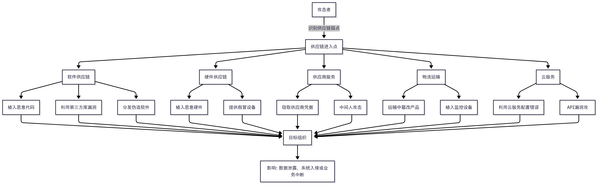

# 挖矿和供应链攻击类型与安全措施简介
- 挖矿攻击
> 加密货币挖矿攻击，是一种利用恶意软件或恶意代码在受害者设备上非法挖取加密货币的攻击方式。这种攻击通常通过感染受害者的计算机、服务器或移动设备，利用其计算资源进行加密货币挖矿，从而获取非法收益。

- 入侵方式：

    

  - 弱口令爆破：
    - 通过暴力破解或泄露的弱口令（如SSH、RDP）入侵系统，部署挖矿恶意软件。
    - Docker、Kubernetes或云服务（如AWS、Azure）的错误配置（如公开API或弱认证）可能被攻击者利用，运行挖矿容器。
  - 社交工程与诱导：
    - 通过社交工程（如伪装YouTube链接、虚假Chrome扩展）诱导用户安装挖矿软件。
    - 例如，FaceXWorm通过Facebook Messenger传播，诱导用户下载恶意扩展。
  - 基于浏览器的攻击：（Web Browser-Based Attacks）
    - 方式：
      - 攻击者在网站或在线广告中嵌入恶意JavaScript代码（如Coinhive脚本），当用户访问受感染的网站或点击广告时，脚本会在用户浏览器中运行，悄悄利用CPU/GPU进行挖矿。
    - 特点：
      - 无需安装软件，关闭浏览器后攻击停止。
      - 常通过供应链攻击（如感染JavaScript库）或妥协合法网站实现。
  - 漏洞攻击：
      - 系统漏洞
        - 利用操作系统（如Windows、Linux）的已知漏洞（例如未及时更新的补丁），通过恶意软件植入挖矿程序。
        - Web服务器或应用程序（如Apache、WordPress插件）的RCE漏洞允许攻击者在服务器上执行挖矿脚本。
      - 应用程序漏洞
          - 未授权访问（Redis、MongoDB、PostgreSQL、Elasticsearch）。
  > 一个 redis 未设置认证暴露到公网，导致服务器被黑客利用恶意挖矿示意图；

  
- 安全措施：
  - 及时更新软件补丁
  - 避免用管理员Root权限启动应用
  - 供应链安全
    - 验证软件来源：仅从可信来源下载软件或更新，检查开源库的完整性（如npm、PyPI包）
    - 代码审查：对第三方代码或库进行安全审查，检测潜在的挖矿代码
  - 访问控制
      - 使用强密码，启用多因素认证（MFA），定期轮换API密钥，避免密钥泄露（如在GitHub公开）
      - 网络绑定，127.0.0.1或者内网IP
      - 自定义端口
      - 核心应用或数据库禁止公网访问
      - 配置安全组只允许内网或者指定IP访问
  - 浏览器保护
    - 启用广告和脚本拦截
  - 最小权限原则
    - 限制云账户权限，仅授予必要访问权限，降低被劫持风险。
  - 入侵检测系统
  - 检测工具：https://www.zoomeye.hk/
    - 可以检查互联网上可以访问的数据库数量及分布

- 总结

挖矿攻击通过隐秘窃取计算资源威胁系统性能和安全，防护需要从浏览器、系统、云环境、IoT设备和供应链等多维度入手。通过加强预防措施（如软件更新、脚本拦截）、部署实时监控（如性能和流量分析）、快速响应（如终止恶意进程、阻断流量）以及持续改进安全策略，可以有效降低挖矿攻击的风险。

- - -
- 供应链攻击
> 供应链攻击是一种传播间谍软件的方式，一般通过产品软件官网或软件包存储库进行传播。通常来说，攻击者会瞄准目标部署官网的服务器，篡改服务器上供用户下载的软件，将间谍软件传播给前往官网下载软件的用户。这些软件包在用户下载后安装时会触发恶意行为。

- 攻击形式
    - 硬件供应链攻击
        - 伪造硬件：提供劣质或伪造的硬件设备，包含恶意功能或易受攻击的弱点。
        - 硬件篡改：在硬件制造或运输过程中植入恶意芯片或固件（如后门硬件）。
    - 软件供应链攻击
        - 恶意代码植入：攻击者在软件开发或分发过程中植入恶意代码。例如，篡改开源软件库、开发工具或软件更新包
        - 源代码
        - 操作系统
        - 软件安装包
        - 向开源软件仓库投毒
            - PyPI、Node.js npm、Maven、RubyGems、Docker Hub
        - 入侵官方网站替换下载链接
    - 加密劫持
        - 电子邮件附件
        - 恶意链接
        - 网络钓鱼
  

- 安全建议
    - 供应链管理
        - 定期审查和评估供应链的安全性
        - 监控对应的软件是否被修改
        - 网络安全控制，包括防火墙、入侵检测系统
    - 权限控制
        - 供应链软件包，编译，发布等审核机制
        - 遵循最低权限访问原则
    - 提高安全意识
        - 确保目标源可靠
        - 仅从官方渠道获取软件
        - MD5 对比
        - 证书签名验证
- 案例：
  - [SolarWinds供应链攻击](https://cloud.google.com/blog/topics/threat-intelligence/evasive-attacker-leverages-solarwinds-supply-chain-compromises-with-sunburst-backdoor)
  - [Ledger Connect Kit 供应链攻击](https://foresightnews.pro/article/detail/49305)

- 总结

供应链攻击因其隐蔽性强、影响范围广，已成为网络安全领域的重大威胁。通过软件篡改、硬件植入、供应商服务入侵、社会工程、物流篡改以及云服务漏洞等多种方式，攻击者能够高效绕过传统防御，深入目标系统。面对这一挑战，组织必须加强供应链风险管理，审查代码与硬件完整性，实施零信任架构，持续监控异常，并强化多因素认证等安全措施。只有通过全面的防御策略和跨组织的协作，才能有效降低供应链攻击的风险，保护关键资产与数据的安全。在日益复杂的数字生态中，守护供应链安全已成为企业与机构不可忽视的战略重点。