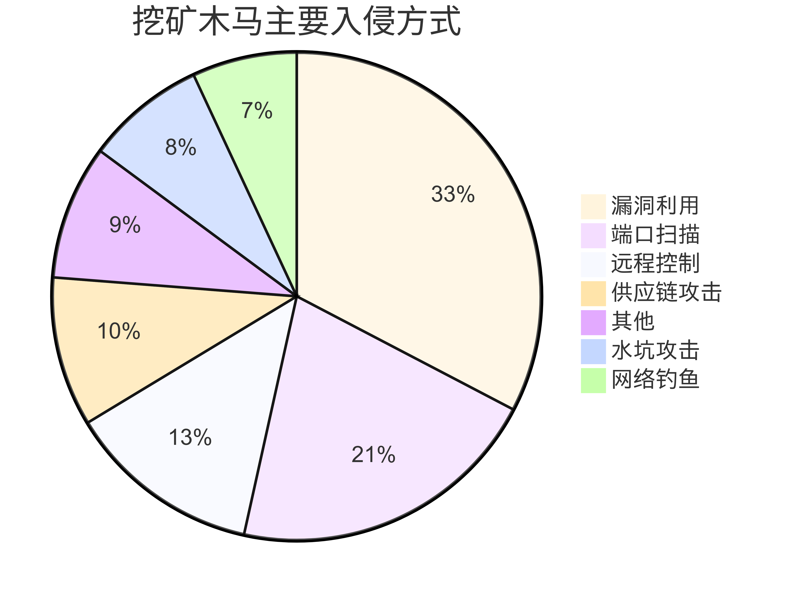
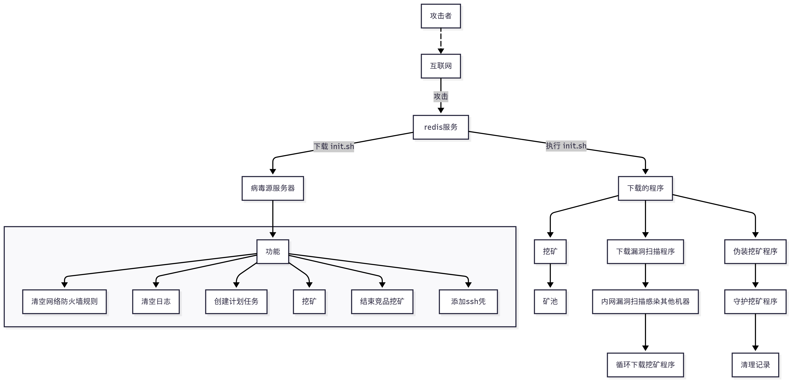
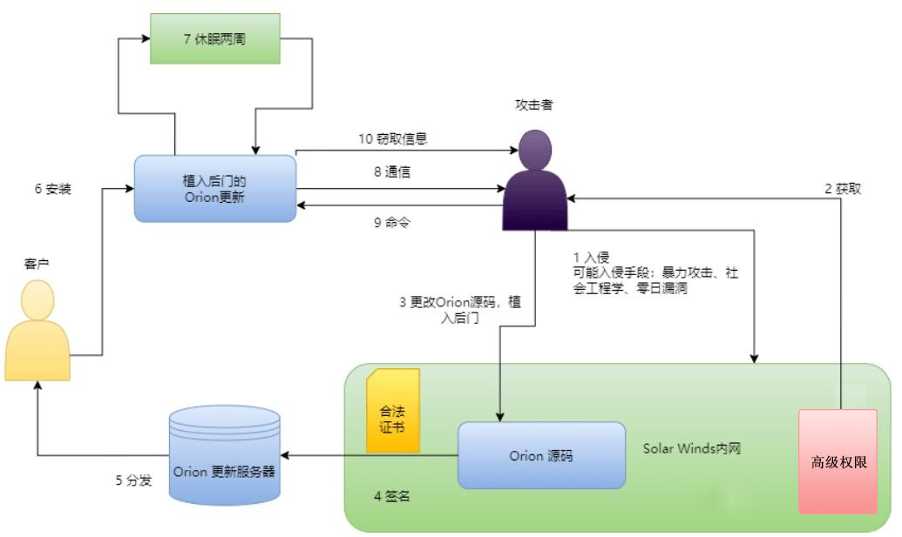

# 挖矿和供应链攻击类型与安全措施简介
> 加密货币挖矿攻击，是一种利用恶意软件或恶意代码在受害者设备上非法挖取加密货币的攻击方式。这种攻击通常通过感染受害者的计算机、服务器或移动设备，利用其计算资源进行加密货币挖矿，从而获取非法收益。

- 入侵方式：
  - 
  - 弱口令爆破：
    - 通过暴力破解或泄露的弱口令（如SSH、RDP）入侵系统，部署挖矿恶意软件。
    - Docker、Kubernetes或云服务（如AWS、Azure）的错误配置（如公开API或弱认证）可能被攻击者利用，运行挖矿容器。
  - 漏洞攻击：
      - 系统漏洞
        - 利用操作系统（如Windows、Linux）的已知漏洞（例如未及时更新的补丁），通过恶意软件植入挖矿程序。
        - Web服务器或应用程序（如Apache、WordPress插件）的RCE漏洞允许攻击者在服务器上执行挖矿脚本。
      - 应用程序漏洞
          - 未授权访问（Redis、MongoDB、PostgreSQL、Elasticsearch）。
  > 一个 redis 未设置认证暴露到公网，导致服务器被黑客利用恶意挖矿示意图；

  
- 安全措施：
  - 及时更新软件补丁
  - 避免用管理员Root权限启动应用
  - 访问控制
      - 密码认证，使用强密码
      - 网络绑定，127.0.0.1或者内网IP
      - 自定义端口
      - 核心应用或数据库禁止公网访问
      - 配置安全组只允许内网或者指定IP访问
  - 入侵检测系统
  - 检测工具：https://www.zoomeye.hk/
    - 可以检查互联网上可以访问的数据库数量及分布

> 供应链攻击是一种传播间谍软件的方式，一般通过产品软件官网或软件包存储库进行传播。通常来说，攻击者会瞄准目标部署官网的服务器，篡改服务器上供用户下载的软件，将间谍软件传播给前往官网下载软件的用户。这些软件包在用户下载后安装时会触发恶意行为。

- 攻击形式
    - 硬件供应链攻击
        - 预装恶意软件的设备
    - 软件供应链攻击
        - 源代码
        - 操作系统
        - 软件安装包
        - 向开源软件仓库投毒
            - PyPI、Node.js npm、Maven、RubyGems、Docker Hub
        - 入侵官方网站替换下载链接
    - 加密劫持
        - 电子邮件附件
        - 恶意链接
        - 网络钓鱼
- 安全建议
    - 供应链管理
        - 定期审查和评估供应链的安全性
        - 监控对应的软件是否被修改
        - 网络安全控制，包括防火墙、入侵检测系统
    - 权限控制
        - 供应链软件包，编译，发布等审核机制
        - 遵循最低权限访问原则
    - 提高安全意识
        - 确保目标源可靠
        - 仅从官方渠道获取软件
        - MD5 对比
        - 证书签名验证
- 案例：
  - [SolarWinds供应链攻击](https://cloud.google.com/blog/topics/threat-intelligence/evasive-attacker-leverages-solarwinds-supply-chain-compromises-with-sunburst-backdoor)
  - [Ledger Connect Kit 供应链攻击](https://foresightnews.pro/article/detail/49305)